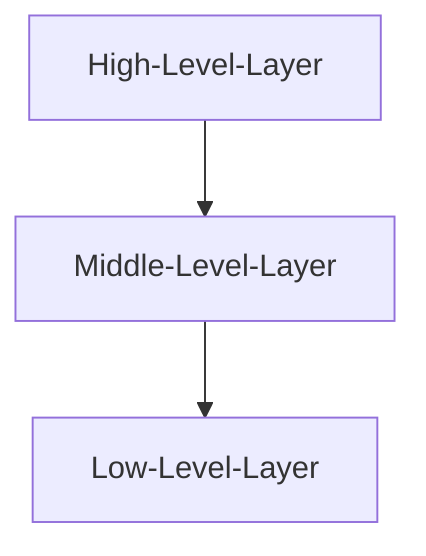

# A Basic Vantor Engine Application

In this guide, we'll create our first Vantor Engine application that works cross-platform on all supported platforms using the same logic and just a few lines of C++ code.
First, let's examine how Vantor Engine's API is structured and how we can access it.

## Vantor's API Architecture

The Vantor Engine consists of three layers of API code, allowing us to choose the appropriate level for different use cases.



We'll use the **High-Level Layer**, which is designed for indie developers and abstracts many of the complexities of cross-platform compatibility.

The **Middle-Level Layer** provides objects that we can control directly, such as `RenderPaths` or the `RenderDevice` itself, allowing us to manipulate rendering behavior on different platforms.

The **Low-Level Layer** is the abstraction and performance-critical layer that we can also control through custom engine modifications or when writing our own abstraction layers.

## Coding Our Application

We can use the High-Level API to create our own application and window context, allowing us to dive right into game development!

First, we'll include the engine's API in our code with a simple include statement:

```cpp title='main.cpp'
#include <Vantor/Vantor.hpp>
```

This statement includes all the core functionality we need to develop our Vantor Engine application.

Next, we'll create the main function and main loop, including our `VApplication` object:

```cpp title='main.cpp'
#include <Vantor/Vantor.hpp>

// highlight-start
int main() {
    Vantor::VApplication app; // This is our VApplication object

    // Application creation data (as a struct)
    Vantor::VApplicationCreateInfo appInfo;
    appInfo.windowWidth = 1280; // Window width
    appInfo.windowHeight = 720; // Window height
    appInfo.windowTitle = "MyVantorApplication"; // Window title

    // Initialize the application
    app.Initialize(appInfo);

    // Run application logic
    while (app.IsRunning()) {
        app.BeginFrame();

        // Here you will put your game's update and rendering logic

        app.EndFrame();
    }

    app.Shutdown();

    return 0;
}
// highlight-end
```

When we build and run this code with CMake and Make, we'll see an empty black window with our specified window title!
Congratulations! You've just created your first cross-platform application context with Vantor Engine! But there's much more to explore.

## What Just Happened?

In summary, we created a `VApplication` object that requires initialization information (`VApplicationCreateInfo`) to be set up properly.
Behind the scenes, the `VApplication` handles input management, rendering setup, resource management, and much more, so we don't need to configure these systems manually.

In the main loop, the application creates a new frame with `BeginFrame()` and instructs the window context and render device to prepare a new frame for rendering while updating all objects and utilities that need to be refreshed each frame.